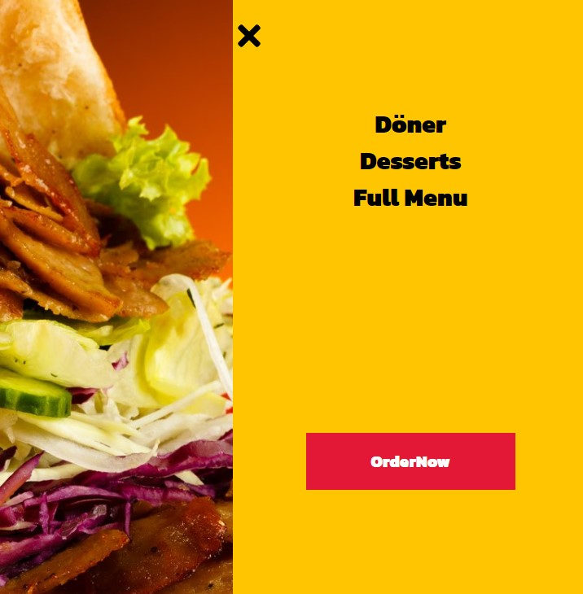

<h1 align="center">Online--Bestellung</h1>


## Description

Eine Project zum Online-Verkauf. 
Bei diesem Projekt haben wir "React Side Bar Components"  verwendet.


## This is short photos about this app.


<br>
<br>

<br>
<br>

<br>
<br>



### At the end of the project, following topics are to be covered;

- HTML
- CSS
- JS
- [React](https://reactjs.org/)


```bash

$ git clone https://github.com/KamilCetiner/Online--Bestellung.git


```
## PACKAGES

```bash

$ npx create-react-app my-app

$ yarn add axios

$ yarn install react react-dom

$ yarn add react-icons

$  yarn add react-router-dom

$ yarn add styled-components


```

## Contact

- GitHub [@Kamil](https://github.com/KamilCetiner)
- Linkedin [@Kamil](https://www.linkedin.com/in/kamil-%C3%A7etiner-b09a601ab/)
